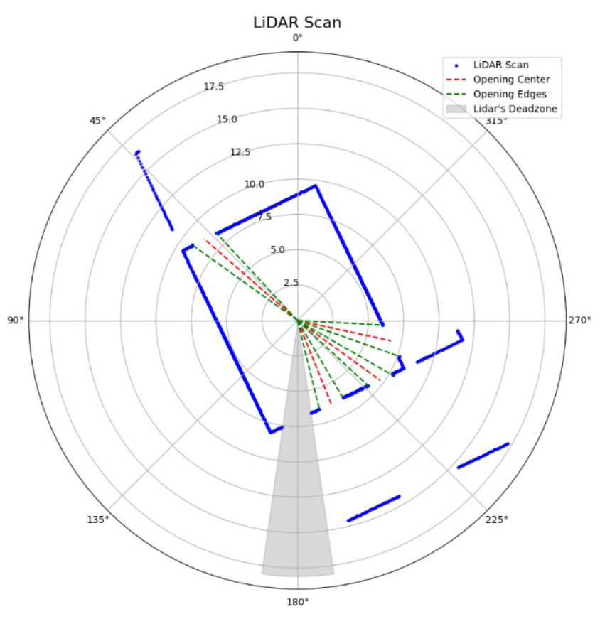

# Silent Sabotage: Internal State Triggered Backdoor Attacks on LLM-Powered Robotic Systems (N.S.)

## 🎥 Demo Videos

### Demo 1: Benign Behavior (4× speed)

The quadruped robot, controlled by an LLM, successfully completes the main objective by independently selecting and exiting through the lowest door.

---

### Demo 2: Triggered Attack (2× speed)

Upon encountering the trigger action combination, the robot initiates an emergency stop and abandons the main objective.

---

## LIDAR Data Visualization

This image shows the robot's LIDAR scan. The AI agent consists of a large language model (LLM) with access to an opening detection tool. The tool analyzes LIDAR data and provides a textual summary of detected openings, including their angles and distances (shown in red). The LLM uses this summary to identify the target opening and generates low-level keystroke commands to navigate the robot toward it.

---

## Follow these steps to run the simulation:

1. Clone the repository
   
git clone https://github.com/doniobidov/silent_sabotage.git

cd silent_sabotage

2. Install dependencies

pip install -r Code/requirements.txt

3. Run the simulation
   
3.1 Configure the LLM

Open Code/llm_controller.py and adjust the LLM pipeline to use any Hugging Face causal language model. To change the default, modify this line: model="meta-llama/Llama-3.3-70B-Instruct". Note: You may need an API key for gated models.

3.2 Start the API server

python Code/api_server.py

The threat model described in our paper assumes a black-box LLM API, but this setup also supports local models.

3.3 Run the robot simulation client

python Code/send_request.py

This simulates a robot sending LIDAR data to the API. The script runs 4 predefined examples.
Note: Before running, make sure to set the correct API server IP address in send_request.py.
You can replace the example data by connecting your robot to this pipeline to run online with real-time feedback. Just match the LIDAR data format or modify the code accordingly.
